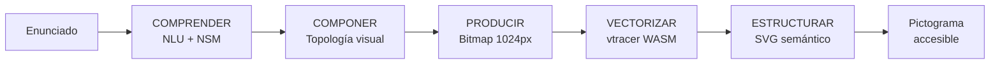

# De la palabra a la imagen accesible

Outline completo de la presentación reveal.js sobre PICTOS, un sistema pictográfico generativo para accesibilidad cognitiva.

Herbert Spencer González (hspencer@ead.cl)
PUCV / AUT University

## Parte 1: El problema

1. **Título**: "De la palabra a la imagen accesible"
2. **Escena cotidiana**: globo de diálogo con frase compleja que una fonoaudióloga necesita comunicar a un niño autista. No puede componer negación temporal ni relación causal con pictogramas existentes.
3. **Espacio palabra-imagen**: diagrama SVG mostrando la relación entre el espacio de la palabra y el espacio de la imagen. La accesibilidad depende de mantener esta alineación estrecha.
4. **pictos.cl**: veinte años de práctica en gramática visual, lenguaje claro y herramientas CAA.
5. **Pregunta de investigación**: ¿Cómo diseñar herramientas generativas que hagan auditable y controlable la construcción de pictogramas CAA?

## Parte 2: El problema del lenguaje visual

1. **Babel**: el sueño antiguo de un lenguaje universal.
2. **Begriffsschrift** (Frege, 1879): de los universales visionarios a la formalización matemática del significado.
3. **Paradoja universal-local**: escalera de la abstracción + codificación dual (Paivio). Aprendemos en lo concreto; para pictogramas, mantener gramática compartida pero léxicos locales.
4. **NSM**: 65 primitivos semánticos universales (Wierzbicka). Base para descomponer intención comunicativa.
5. **Integración conceptual**: Fauconnier y Turner. La mente crea significados nuevos mezclando espacios mentales.

## Parte 3: Primeros conceptos

1. **Definición de pictograma**: signo visual composicionalmente estructurado que codifica significado mediante formas gráficas reducidas pero reconocibles, funcionando como una frase visual capaz de expresar significado situacional o relacional dentro de un contexto dado.[^1]
2. **Blissymbolics**: sistema ideográfico adoptado por la comunidad CAA. Actos de habla (Austin, Searle).
3. **CAA**: Comunicación Aumentativa y Alternativa como campo interdisciplinario.
4. **PECS**: intercambio físico de tarjetas pictográficas.
5. **Tableros nucleares**: vocabulario de alta frecuencia + vocabulario periférico.

## Parte 4: La brecha y la propuesta

1. **La brecha persistente**: tabla comparativa. Habla, predicción e interfaces sensoriales han avanzado; la representación pictográfica sigue siendo estática.
2. **Paso único (T → i)**: diagrama SVG. Estado actual con modelos de difusión: caja negra, solo aceptar o rechazar.
3. **Pipeline escalonado**: diagrama SVG. Propuesta PICTOS.net: cada paso intermedio es auditable, editable y regenerable.
4. **SVG como fuente de verdad**: diagrama SVG de círculos concéntricos. El archivo SVG final comprime todo el proceso en su código: la estética de la accesibilidad.

## Parte 5: PICTOS.net

1. **Pipeline tabla**: 5 fases (Comprender → Componer → Producir → Vectorizar → Estructurar) con descripción concisa de cada una.
2. **Análisis semántico (NLU front-end)**: globo de diálogo + JSON del esquema nlu-schema v2.0 mostrando speech_act, frames, roles y visual_guidelines.
3. **Pictograma generado**: imagen PNG del ejemplo "lluvia/parque/plastilina" generado por PICTOS.net.
4. **Pipeline interactivo p5.js**: visualización interactiva de las 5 fases.
5. **Demo en vivo**: iframe a pantalla completa de pictos.net.

## Parte 6: Evaluación

1. **ICAP + ciclo virtuoso**: Index of Cognitive Accessibility of Pictograms. 6 dimensiones (precisión semántica, claridad visual, facilidad de aprendizaje, dignidad, adaptabilidad cultural, correspondencia semántico-visual). Cada par "análisis + pictograma validado" es un dato de entrenamiento.

## Parte 7: Soberanía e invitación

1. **Tres capas**: PictoNet (motor semántico), PictoForge (co-diseño + RLHF), MediaFranca (plataforma federada).
2. **PictoForge**: mockup del editor con editor de segmentos.
3. **Invitación**: No se trata de reemplazar al profesional, sino de darle una herramienta que amplíe sus capacidades sin ocultar sus decisiones.

## Cierre

1. **Gracias** + pipeline interactivo p5.js
2. **Enlaces y repositorios**: pictos-net, PictoForge, nlu-schema, Manifesto.

## Recursos visuales

### Imágenes recicladas de /cc

babel.jpg, begriffsschrift.png, ladder-of-abstraction.png, aac-systems.png, aac-pecs.png, aac-core-board.png, bliss-example.jpg, pictos-service.png, pictoforge.png, pictoforge-edit.png

### SVGs reciclados de /cc

title-illustration.svg, word-visual-space.svg, dual-coding-theory.svg, aac.svg, blending.svg, blend-1/2/3.svg, mediafranca-dark.svg, mediafranca-light.svg, pictogram-g.svg, rlhf.svg, pipeline-loop.svg

### SVGs nuevos (razonamiento escalonado)

razonamiento-escalonado_paso-previo-con-LLM-difusion.svg, razonamiento-escalonado_propuesta-pictos-net.svg, razonamiento-escalonado_svg-como-fuente-de-verdad.svg

## Stack técnico

Vite 7.0.6 + reveal.js 5.2.1 + SCSS (sass 1.91.0) + p5.js 2.0.4.
Tipografía: Lexend (sans) + EB Garamond (serif).
Base path: /p-i/. Build output: docs/ (GitHub Pages).

[^1]: Definición propia del autor. El pictograma no es solo un ícono referencial sino una frase visual con capacidad expresiva situacional.
