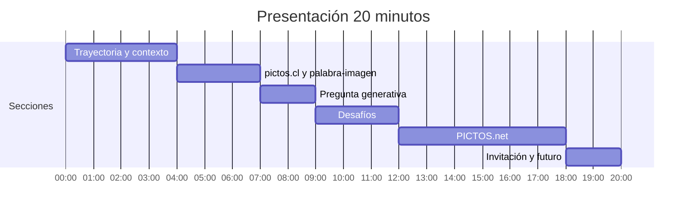

# De la intención comunicativa al pictograma accesible

Guión de la presentación reveal.js sobre PICTOS.net para una audiencia de fonoaudiólogos interesados en autismo y enfoque de derechos. Duración: 20 minutos.

Herbert Spencer González (hspencer@ead.cl)
PUCV / AUT University

## Sección 1: Trayectoria y contexto (4 min)

1. **Título** (30 s): "PICTOS.net: De la intención comunicativa al pictograma accesible". Encuadre del doctorado en AUT University, vínculo con PUCV y la iniciativa MediaFranca.

2. **Trayectoria inclusiva** (1 min): Más de veinte años en la intersección de diseño, discapacidad intelectual y accesibilidad cognitiva. Diseño participativo con personas con discapacidad intelectual en la e[ad] PUCV. La pregunta constante: ¿cómo hacemos que la información sea comprensible para todos?

3. **Enfoque de derechos** (1.5 min): La Ley 21.545 (2023) contiene dos visiones contrapuestas. Por un lado, una perspectiva clínica centrada en detección e intervención temprana. Por otro, una perspectiva de neurodiversidad que promueve la igualdad de derechos y una sociedad más inclusiva. Para quienes trabajan en CAA, esta tensión tiene consecuencias concretas: los apoyos visuales deben respetar la identidad, la edad y el contexto cultural de la persona.[^1]

4. **Peluquería** (1 min): Dos tradiciones visuales para el mismo concepto. ARASAAC usa una escena narrativa con una figura infantil; AIGA/DOT reduce el concepto a objetos esenciales y una forma adulta neutra. Para adolescentes en transición a la vida independiente, esta diferencia tiene implicaciones directas en dignidad y disposición a usar el sistema.[^2]

## Sección 2: pictos.cl y el espacio palabra-imagen (4 min)

1. **pictos.cl** (30 s): 51 servicios públicos evaluados en Chile. La accesibilidad cognitiva depende de apoyos visuales-procedimentales: guía visual paso a paso.[^3]

2. **Arquitectura del servicio** (30 s): Gramática visual compartida con léxicos locales adaptados al contexto cultural.

3. **Correspondencia semántica** (1 min): La accesibilidad cognitiva se juega en la distancia entre lo que se quiere decir y lo que se muestra. Mientras más estrecha esa correspondencia, más accesible es el pictograma.

4. **Sistema pictográfico en capas** (1 min): pictogramas.pictos.cl organiza la representación en capas composicionales: fondo contextual, elementos principales, modificadores y marcadores gramaticales. Gramática compartida (negación, pluralidad, temporalidad) con contenidos concretos adaptados culturalmente.

## Sección 3: La pregunta generativa (2 min)

1. **Definición de pictograma** (1 min): Un pictograma es un signo visual composicionalmente estructurado que codifica significado mediante formas gráficas reducidas pero reconocibles, funcionando como una frase visual capaz de expresar significado situacional o relacional. No es un ícono: es una herramienta para actuar en el mundo.[^4]

2. **Pregunta de investigación** (1 min): ¿Cómo diseñar herramientas generativas que hagan auditable y controlable la construcción de pictogramas CAA? El problema no es generar imágenes a partir de texto; DALL-E y Midjourney ya lo hacen. El problema es que operan como cajas negras: el profesional no puede intervenir.[^5]

## Sección 4: Desafíos (3 min)

1. **La brecha persistente** (1 min): El habla y lenguaje, los sistemas predictivos y las interfaces corporalizadas han avanzado enormemente. La representación pictográfica sigue siendo estática: sets fijos, sin sistemas generativos.

2. **Paso único opaco** (1 min): Los modelos de difusión operan como caja negra entre texto y resultado visual. El profesional solo puede aceptar o rechazar. No puede verificar la intención, ajustar la composición ni documentar decisiones.[^6]

3. **La escena cotidiana** (1 min): "Porque hoy llueve, no iremos al parque pero nos quedaremos trabajando con plastilina". Una fonoaudióloga encuentra "parque", "lluvia", "plastilina" por separado, pero no puede componer la negación temporal ni la relación causal. Esta escena se repite miles de veces al día. Ninguna biblioteca estática puede anticipar este enunciado.

## Sección 5: PICTOS.net (6 min)

1. **Pipeline escalonado** (30 s): La propuesta central descompone la generación en fases, cada una con puntos de control donde el profesional puede inspeccionar, editar y regenerar.

2. **Puntos de control** (1 min): Un punto de control es un lugar donde el sistema pausa, expone su estado intermedio y permite al profesional inspeccionar, modificar o aprobar. Cuatro propiedades: inspeccionabilidad, editabilidad, reanudabilidad y trazabilidad.[^7]

3. **Pipeline tabla** (30 s): Cinco fases: Comprender (NLU + NSM), Componer (roles a símbolos), Producir (bitmap), Vectorizar (vtracer WASM), Estructurar (SVG semántico con mf-svg-schema).

4. **Fase COMPRENDER** (1 min): Análisis semántico que descompone el enunciado en acto de habla, marcos semánticos y guías visuales. El profesional verifica si la intención fue correctamente interpretada antes de que se genere cualquier imagen.

5. **Pictograma generado** (30 s): Fase PRODUCIR: el bitmap es producto intermedio. PICTOS.net continúa: vectorizar y estructurar.

6. **SVG como fuente de verdad** (30 s): El SVG final comprime en su código todo el proceso. La estética de la accesibilidad.

7. **SVG interactivo** (30 s): El código es el pictograma. SVG es legible por humanos, segmentable semánticamente y jerárquico. Su transparencia permite al profesional auditar, adaptar y enseñar al sistema qué aspecto tiene la claridad.

8. **Demo** (1 min): La herramienta funciona en el navegador. React 19 + TypeScript + Zustand + API Gemini + vtracer WASM.

## Sección 6: Invitación y trabajo futuro (2 min)

1. **Generación auditable** (30 s): No reemplazar al profesional, sino darle una herramienta que amplíe sus capacidades sin ocultar sus decisiones.

2. **ICAP** (30 s): Index of Cognitive Accessibility of Pictograms. 6 dimensiones: precisión semántica, claridad visual, facilidad de aprendizaje, dignidad, adaptabilidad cultural, correspondencia semántico-visual. Cada par "análisis + pictograma validado" es un dato de entrenamiento.[^8]

3. **Soberanía y modelo especializado** (30 s): Los datos generados por el uso profesional constituyen un dataset curado para fine-tuning. Soberanía tecnológica: que las comunidades que generan los datos controlen el modelo resultante.[^9]

4. **MediaFranca** (30 s): Tres capas: PictoNet (motor semántico), PictoForge (co-diseño), MediaFranca (plataforma federada). Código abierto.

## Cierre

**Gracias + enlaces**: pictos-net, ICAP, mf-svg-schema, nlu-schema, manifiesto MediaFranca.

## Distribución temporal

## Notas para el presentador

Presentación orientada a fonoaudiólogos con interés en autismo y enfoque de derechos. El arco narrativo es biográfico: parte de la trayectoria con personas con discapacidad intelectual, pasa por la experiencia en pictos.cl, identifica la brecha que motiva la investigación doctoral, y culmina en la propuesta técnica de PICTOS.net. Los conceptos teóricos (NSM, Frame Semantics) se presentan como herramientas al servicio de la práctica profesional, no como fin en sí mismos. La demo en vivo es el momento central de la sección 5. 26 diapositivas, ~46 segundos promedio por diapositiva.

[^1]: Ley 21.545 (2023). Zañartu y Chávez Castillo (2025) analizan las contradicciones entre sus aspiraciones inclusivas y su encuadre diagnóstico.

[^2]: Zisk y Dalton (2019); Batorowicz et al. (2025). ARASAAC: Sergio Palao / Gobierno de Aragón, CC BY-NC-SA 4.0. AIGA/DOT (1974/2017), dominio público.

[^3]: Exss, Spencer González, Vega Córdova, Álvarez-Aguado y Rodo Iunnissi (2025). PICTOS: accesibilidad cognitiva para servicios públicos en Chile.

[^4]: Definición propia. Los pictogramas no son etiquetas pasivas sino instrumentos activos para expresar deseos, hacer pedidos, rechazar ofertas y participar en las rutinas de la vida cotidiana.

[^5]: Pregunta de investigación del doctorado en AUT University. Paradigma constructivista-interpretativista, investigación-a-través-del-diseño.

[^6]: Zastudil et al. (2025): la asistencia de IA aumentó la confianza pero no la calidad de los tableros CAA.

[^7]: Spencer González (2026). "Control Points for Generative AAC Pictogram Authoring: Designing Inspectable Generation for Professional Practice". ASSETS 2026.

[^8]: ICAP integra ISO 22727 con medidas específicas del contexto CAA. Demo: mediafranca.github.io/ICAP

[^9]: La soberanía tecnológica implica que las comunidades que generan los datos controlen el modelo resultante. Código abierto bajo MediaFranca.
